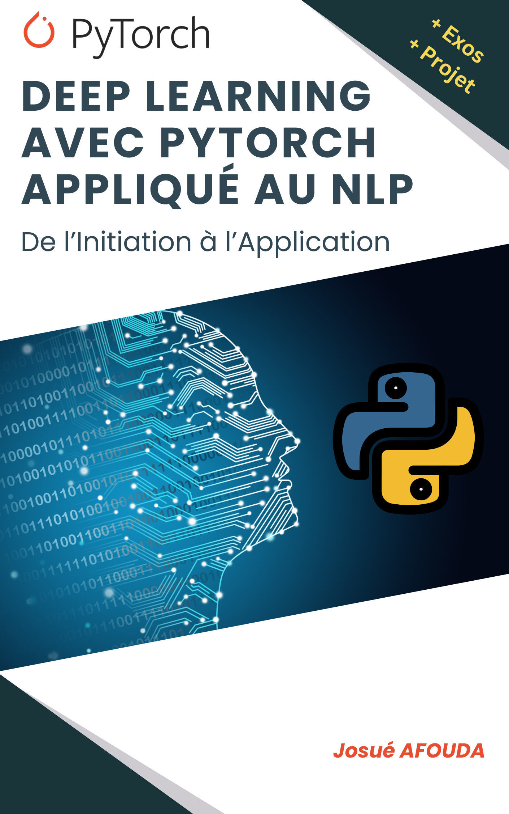

# PytorchSMSclassification

## Description
PytorchSMSclassification est un projet pour classifier les messages SMS en utilisant PyTorch. Ce dépôt contient le code et les ressources nécessaires pour construire et déployer un modèle de classification de SMS.

## Installation
1. Clonez le dépôt :
   ```bash
   git clone https://github.com/joshafouda/PytorchSMSclassification.git
   cd PytorchSMSclassification
   ```
2. Installez les dépendances requises :
   ```bash
   pip install -r requirements.txt
   ```

## Utilisation
1. Pour entraîner le modèle, exécutez :
   ```bash
   python sms_classification.py
   ```
2. Pour classifier un nouveau message SMS, utilisez l'application Streamlit `app.py` :
   ```bash
   streamlit run app.py 
   ```

Vous pouvez tester l'application avec ces SMS :

"Have you had a good day? Mine was really busy are you up to much tomorrow night?",

"ree entry in 2 a weekly comp for a chance to win an ipod. Txt POD to 80182 to get entry (std txt rate) T&C's apply 08452810073 for details 18+",

"Hope you are not scared!",

"Call 09094100151 to use ur mins! Calls cast 10p/min (mob vary). Service provided by AOM, just GBP5/month. AOM Box61,M60 1ER until u stop. Ages 18+ only!"

Une fois satisfait, vous pouvez déployez l'application dans https://share.streamlit.io/

## Fichiers
- `sms_classification.py` : Script principal pour entraîner le modèle.
- `app.py` : Script de l'application web pour classifier de nouveaux messages SMS.
- `utils.py` : Fonctions utilitaires.
- `requirements.txt` : Liste des dépendances.
- `vectorizer.pkl` : Vectoriseur pré-entraîné.
- `trained_model.pth` : Modèle pré-entraîné.

## Deep Learning avec PyTorch appliqué au Traitement du Langage Naturel

J'ai écrit un livre pour vous guider à travers les concepts fondamentaux et avancés du deep learning et du traitement du langage naturel (NLP), en utilisant PyTorch. 



À la fin de ce livre, vous serez capable de :

    - Comprendre et appliquer les concepts fondamentaux du deep learning avec PyTorch.

    - Construire, entraîner et évaluer des modèles de réseaux neuronaux pour diverses applications.

    - Appliquer des techniques de NLP pour prétraiter et analyser des données textuelles.

    - Mettre en œuvre un projet complet de classification de texte, de la collecte des données à l'intégration du modèle dans une application web.

Pour téléchargez une copie PDF de ce livre, cliquez sur ce [lien](https://buy.stripe.com/00gdUS7Jk0oqgx29AU).